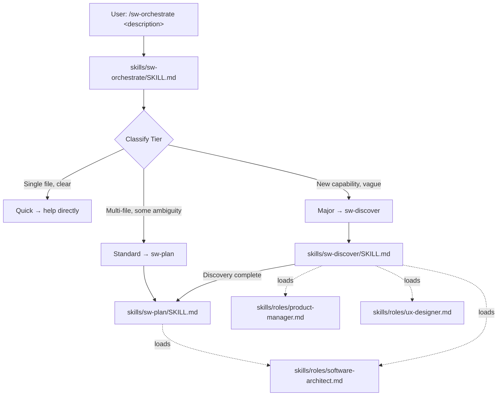

# feat: Shipwright P1 — Plugin Foundation, Orchestrator, Discover, Plan & Roles

## Enhancement Summary

**Deepened on:** 2026-04-10
**Agents used:** plugin-structure-review, agent-development-review, architecture-strategist, pattern-recognition-specialist, code-simplicity-reviewer, agent-native-architecture, plugin-validator, best-practices-researcher

### Key Improvements
1. **Namespace prefix (`sw:`) for all skills** — avoids collision with Claude Code's built-in `/plan` command
2. **Simplified P1 scope** — removed session resumption, version suffixes, reference files, and methodology.md (YAGNI)
3. **Agent-native considerations** — structured artifact frontmatter, outcome-driven workflows, auto-proceed transitions
4. **Fixed SKILL.md descriptions** — triggers-only format, no workflow summary (prevents Claude from shortcutting)
5. **Added `allowed-tools` and `AGENTS.md`** — follows conventions from both reference plugins

### New Considerations Discovered
- Skills cannot programmatically invoke other skills — phase transitions depend on conversational flow
- CLAUDE.md should be ~20 lines (cross-cutting rules only), not methodology documentation
- Role files should target 80-120 lines (Claude already knows what a PM is — only specify what's unique)
- The `description` field must never summarize the workflow, or Claude may shortcut the full SKILL.md body

---

## Overview

Build the first release phase of Shipwright, a Claude Code plugin that provides an opinionated development methodology optimising for shipping products — not just writing code. P1 delivers the novel differentiation: the orchestrator (tiered complexity routing), the Discover phase (PM-led product thinking), the Plan phase (Architect-led design), and three role definitions (PM, UX, Architect).

P1 is the foundation that all subsequent phases (P2: Build/Ship/Developer/QA, P3: research agents/learning loops) build on. It must establish the plugin structure, role loading conventions, artifact storage patterns, and orchestrator routing that later phases extend — not replace.

## Problem Statement / Motivation

Existing Claude Code skills (superpowers, compound-engineering) optimise for coding workflows — brainstorming, TDD, code review, deployment. They assume the user already knows *what* to build. Shipwright addresses the gap before and around implementation: helping users figure out what to build (Discover), how to structure it (Plan), and routing to the appropriate depth of process based on task complexity.

**Target audience:** Developers using Claude Code on non-trivial projects who have experienced "Claude wrote the code fine but built the wrong thing" or "it coded fast but the result was fragile."

## Proposed Solution

Implement Shipwright P1 as a Claude Code plugin with:

1. **Plugin manifest** (`.claude-plugin/plugin.json`) — registration with Claude Code
2. **CLAUDE.md** — minimal cross-cutting behavioral rules (~20 lines)
3. **AGENTS.md** — structural conventions and contributor guidelines
4. **Orchestrator skill** (`skills/sw-orchestrate/SKILL.md`) — entry point, tier classification, phase routing
5. **Discover skill** (`skills/sw-discover/SKILL.md`) — PM-led discovery phase
6. **Plan skill** (`skills/sw-plan/SKILL.md`) — Architect-led planning phase
7. **Three role definitions** (`skills/roles/{product-manager,ux-designer,software-architect}.md`) — passive persona files loaded by phase skills
8. **Artifact conventions** — `docs/shipwright/` directory structure in user projects

### Research Insights: Namespace Prefix

**Why `sw:`?** Claude Code has built-in `/plan` and `/review` commands. Compound-engineering uses `ce:` prefix for exactly this reason (documented in their AGENTS.md). Bare skill names like `plan` and `discover` would collide or create ambiguity. The `sw-` directory prefix (rendered as `sw:` in slash commands) makes ownership unambiguous.

**Why descriptive role filenames?** Both reference plugins use descriptive kebab-case names (e.g., `architecture-strategist.md`, `repo-research-analyst.md`). Terse abbreviations like `pm.md` are less discoverable. `product-manager.md`, `ux-designer.md`, `software-architect.md` follow established conventions.

## Technical Approach

### Architecture



### Plugin Structure

```
shipwright/
├── .claude-plugin/
│   └── plugin.json                   # Plugin manifest (required)
├── CLAUDE.md                         # Cross-cutting behavioral rules (~20 lines)
├── AGENTS.md                         # Structural conventions & contributor guidelines
├── README.md                         # Installation, usage, credits
├── LICENSE                           # MIT
├── .gitignore                        # Standard ignores
├── skills/
│   ├── sw-orchestrate/
│   │   └── SKILL.md                  # Entry point — tier classification & routing
│   ├── sw-discover/
│   │   └── SKILL.md                  # Phase 1 — PM-led discovery
│   ├── sw-plan/
│   │   └── SKILL.md                  # Phase 2 — Architect-led planning
│   └── roles/
│       ├── product-manager.md        # PM persona definition
│       ├── ux-designer.md            # UX persona definition
│       └── software-architect.md     # Architect persona definition
└── docs/
    └── design.md                     # Design specification (existing)
```

### Research Insights: Simplified Structure

**Why no `references/` directories in P1?** The content planned for reference files (tier heuristics = ~15 lines, discovery template = ~20 lines, plan template = ~25 lines, ADR format = already in architect role) is small enough to inline in each SKILL.md. The 500-line limit is not at risk. Extract to `references/` only when a SKILL.md actually approaches the limit. This eliminates 4 files and reduces cross-file reads during skill execution.

**Why no `docs/methodology.md`?** The design spec (`docs/design.md`) already serves as the methodology document. `CLAUDE.md` carries the behavioral rules for the LLM. `README.md` covers installation for humans. A third document explaining the same content to a nonexistent audience is YAGNI for P1.

**Why `AGENTS.md`?** Both reference plugins (superpowers, compound-engineering) maintain contributor guidelines. Compound-engineering uses a separate `AGENTS.md` referenced from `CLAUDE.md`. This keeps the always-loaded `CLAUDE.md` minimal while still providing development conventions.

**Plugin `docs/` vs. user `docs/shipwright/`:** The `docs/` directory at the plugin root contains plugin documentation shipped with the plugin (currently just `design.md`). The `docs/shipwright/` directory is created at runtime in the *user's project repo* for artifacts. These are distinct — one is read-only plugin content, the other is user-owned output.

**Key structural decisions:**

## ADR: Role files as shared references, not skills

**Status:** Accepted  
**Context:** Roles need to be loaded by multiple phase skills. The design spec puts them at `skills/roles/*.md`. Plugin auto-discovery expects `skills/<name>/SKILL.md` structure, but roles are NOT invokable skills — they are passive persona definitions.  
**Options:** (A) Put roles inside each phase skill's `references/` directory (duplicates content), (B) Put roles at `skills/roles/*.md` as plain markdown files (no SKILL.md, not auto-discovered as skills), (C) Create a `roles/` top-level directory outside `skills/`, (D) Make roles SKILL.md files with `user-invocable: false`.  
**Decision:** Option B — `skills/roles/*.md` as plain files with lightweight YAML frontmatter (name, type, voice, phases). Phase skills reference them via markdown link syntax: `[Product Manager](../roles/product-manager.md)`. No SKILL.md means Claude Code won't surface them as invokable slash commands. They stay in `skills/` for co-location with the skills that use them.  
**Consequences:** Roles are DRY. Phase skills must include explicit "read these role files" instructions using proper markdown link syntax (NOT backtick references — Claude follows links but treats backticks as string literals). This is an intentional exception to the one-level-deep reference convention since roles are shared across skills. Option D was rejected because it would put all role descriptions into Claude's always-on context budget (~2% discovery overhead) even when no phase skill is active.

### Research Insights: Role File Loading

Phase skills MUST use proper markdown link syntax for role references:
```markdown
## Role Loading
Read and apply these role perspectives for this phase:
- [Product Manager](../roles/product-manager.md) (lead role)
- [UX Designer](../roles/ux-designer.md) (support role)  
- [Software Architect](../roles/software-architect.md) (feasibility check)
```

**Verified pattern:** compound-engineering's AGENTS.md mandates: "All files in `references/` are linked as `[filename.md](./references/filename.md)`. No bare backtick references."

**Context budget risk:** Loading 3 roles simultaneously is the biggest context pressure point. Target 80-120 lines per role (not 200). Claude already knows what a PM does — role files should contain only what's unique: the specific voice, the specific questions, the specific output format for Shipwright's methodology.

**Fallback:** If Claude cannot resolve relative paths from the skill's directory, use `skills/roles/product-manager.md` from plugin root. Verify path resolution during Phase 1B/1C testing.

## ADR: Namespace prefix for all skills

**Status:** Accepted  
**Context:** Claude Code has built-in `/plan` and `/review` commands. Compound-engineering uses `ce:` prefix for exactly this reason. Bare skill names like `plan` and `discover` would collide or create ambiguity with other plugins.  
**Options:** (A) Bare names (`plan`, `discover`) relying on auto-namespacing, (B) `sw-` prefix directory names rendering as `sw:plan`, `sw:discover` in slash commands, (C) Full `shipwright-` prefix.  
**Decision:** Option B — `sw-` prefix. Skill directories are `sw-orchestrate`, `sw-discover`, `sw-plan`. Users invoke as `/sw-orchestrate`, `/sw-discover`, `/sw-plan`. Short enough for daily use, unambiguous about ownership.  
**Consequences:** No collision with built-in or other plugin commands. Design spec's `/shipwright plan` becomes `/sw-plan` — simpler, avoids subcommand parsing ambiguity. The `$ARGUMENTS` to `/sw-orchestrate` is always a task description, never a subcommand name.

## ADR: Orchestrator as single entry point with separate phase skills

**Status:** Accepted  
**Context:** The design spec defines `/shipwright` as the default entry, plus per-phase commands.  
**Options:** (A) Single `orchestrate` skill handling all subcommands via `$ARGUMENTS`, (B) Separate skills for each phase, with orchestrate only handling the classification flow.  
**Decision:** Option B — separate skills per phase. `/sw-orchestrate` classifies and routes. `/sw-discover` and `/sw-plan` are independently invokable for direct phase entry.  
**Consequences:** Each phase skill is independently testable. The orchestrator stays focused on classification logic. Users get both auto-routing and direct entry.

### Research Insights: Phase Transition Mechanics

**Critical limitation:** In Claude Code, one skill cannot programmatically invoke another skill. When the orchestrator says "invoke the discover skill," Claude interprets this conversationally — it suggests running the next phase, but execution depends on the user confirming. This is not guaranteed.

**Mitigation:** The orchestrator should use directive language ("Invoke the `sw-discover` skill with the user's description") rather than suggestion language. For Discover→Plan transitions, the Discover skill should explicitly pass the discovery doc path: "Invoke `/sw-plan docs/shipwright/discover/YYYY-MM-DD-<topic>.md`" so the Plan skill receives the upstream artifact directly rather than scanning for it.

## ADR: Artifact naming with date-prefixed kebab-case

**Status:** Accepted  
**Context:** Artifacts go to `docs/shipwright/discover/<topic>.md` and `docs/shipwright/plan/<topic>.md`. The design spec doesn't specify naming conventions.  
**Options:** (A) Plain `<topic>.md` (simple but collision-prone), (B) `YYYY-MM-DD-<topic>.md` (date-prefixed, sortable), (C) Sequence-numbered.  
**Decision:** Option B — `YYYY-MM-DD-<topic>.md`. Topic slug is kebab-case derived by the LLM from the task description. No version suffixes — if a file exists, the skill asks the user whether to overwrite or pick a different name.  
**Consequences:** Artifacts are sortable chronologically and discoverable by topic. No complex slug-matching or versioning logic needed in P1. The LLM naturally picks reasonable filenames.

### Research Insights: Artifact Frontmatter

All artifacts MUST include YAML frontmatter for machine parseability and cross-referencing:

```yaml
---
type: discover          # or: plan
topic: payment-system   # kebab-case slug
tier: major             # quick, standard, major
status: complete        # draft, in-progress, complete
date: 2026-04-10
upstream: null           # path to discovery doc (for plan artifacts)
---
```

**Why:** Enables reliable cross-referencing between discovery and plan docs (match on `topic` field, not fuzzy filename matching). Supports future session resumption (P2/P3) via structured metadata queries. Follows ce-plan's proven pattern of frontmatter in saved artifacts.

**Convention:** Always `mkdir -p` before writing. Write the file to disk before presenting transition options (prevents artifact loss if session ends).

## ADR: Release Manager folded into QA role

**Status:** Accepted (implementation deferred to P2)  
**Context:** The design spec's Ship phase references a "Release Manager" role for release prep, but only five roles are defined.  
**Decision:** Fold Release Manager responsibilities into the QA role definition in P2. QA leads the Ship phase; release prep is a natural extension. Add a clearly delineated "Release Prep" section to the QA role file.  
**Consequences:** Five roles remain. Note: this ADR documents a decision for a role file that does not exist in P1 (QA is P2). It serves as forward guidance for P2 implementation.

### Implementation Phases

#### Phase 1A: Plugin Skeleton, CLAUDE.md & AGENTS.md

Create the foundational plugin structure that Claude Code can discover and load.

**Tasks:**

1. Create `.claude-plugin/plugin.json` with explicit content:
   ```json
   {
     "name": "shipwright",
     "version": "0.1.0",
     "description": "Opinionated development methodology for shipping products, not just writing code",
     "author": { "name": "Francesco" },
     "license": "MIT",
     "keywords": ["methodology", "planning", "discovery", "architecture", "product-thinking"]
   }
   ```
2. Write `CLAUDE.md` — minimal, ~20 lines. Cross-cutting behavioral rules ONLY (this loads into every conversation):
   ```markdown
   # Shipwright
   Opinionated development methodology. Ships products, not just code.
   
   ## Always Active Rules
   - Orchestrator suggests, never blocks. Always let the user proceed.
   - Roles are passive definitions loaded by skills. No role is directly invokable.
   - Artifacts save to `docs/shipwright/` in the user's repo with YAML frontmatter.
   - Match existing codebase patterns. No framework opinions.
   
   ## Principles (Karpathy)
   - Simplicity first — no speculative abstractions
   - Surgical changes — touch only what the task requires
   - Goal-driven — define success before implementing
   
   @AGENTS.md
   ```
3. Write `AGENTS.md` — structural conventions for plugin development:
   - Directory structure and naming conventions (kebab-case, `sw-` prefix)
   - Skill compliance checklist (description triggers, no workflow summary, `allowed-tools`)
   - Role file convention (markdown links, not backtick references)
   - Reference linking convention (proper markdown syntax)
   - Error message format convention: "WARNING: Could not load [resource]. Proceeding with reduced capability."
4. Write `LICENSE` (MIT)
5. Write `README.md` with installation instructions (`claude plugin add` or `--plugin-dir`)
6. Write `.gitignore` (standard ignores)

**Files to create:**
- `.claude-plugin/plugin.json`
- `CLAUDE.md`
- `AGENTS.md`
- `LICENSE`
- `README.md`
- `.gitignore`

**Verification:** `claude --plugin-dir . --print-plugins` shows Shipwright loaded (or equivalent test).

**Success criteria:**
- [ ] Plugin is discoverable by Claude Code
- [ ] CLAUDE.md loads into context when plugin is active
- [ ] CLAUDE.md is under 25 lines
- [ ] AGENTS.md establishes development conventions
- [ ] No SKILL.md files yet — just the foundation

#### Phase 1B: Role Definitions

Define the three P1 roles as passive persona files with lightweight frontmatter.

**Tasks:**

1. Write `skills/roles/product-manager.md` — Product Manager persona:
   - Frontmatter: `name: product-manager`, `type: role`, `voice: "Direct, outcome-focused"`, `phases: [discover]`, `lead-phases: [discover]`
   - Voice: Direct, outcome-focused (from design spec Section 4)
   - Core questions (from design spec Section 4)
   - Output format: problem statement, success criteria, scoped feature list, user stories
   - When active: Discover phase lead, scope change consultant
2. Write `skills/roles/ux-designer.md` — User Experience Designer persona:
   - Frontmatter: `name: ux-designer`, `type: role`, `voice: "Empathetic, flow-oriented"`, `phases: [discover]`
   - Voice: Empathetic, flow-oriented (from design spec Section 4)
   - Core questions (from design spec Section 4)
   - Output format: user flows, screen inventory, interaction notes, accessibility checklist
   - When active: Discover phase support, Plan phase UX consultation
3. Write `skills/roles/software-architect.md` — Architect persona:
   - Frontmatter: `name: software-architect`, `type: role`, `voice: "Systematic, trade-off-aware"`, `phases: [discover, plan]`, `lead-phases: [plan]`
   - Voice: Systematic, trade-off-aware (from design spec Section 4)
   - Core questions (from design spec Section 4)
   - ADR format template (inline, lightweight — the canonical location for ADR format)
   - Output format: component diagram (Mermaid), interface contracts, ADRs
   - When active: Discover feasibility check, Plan phase lead

**Files to create:**
- `skills/roles/product-manager.md`
- `skills/roles/ux-designer.md`
- `skills/roles/software-architect.md`

**Verification:** Each role file is readable, has consistent structure, contains all questions/outputs from the design spec.

### Research Insights: Role File Best Practices

- **Target 80-120 lines per role, not 200.** Claude already knows what a PM does. Only include what's unique to Shipwright: the specific voice, the specific questions from the design spec, the specific output format. Trim anything Claude would do by default.
- **Include frontmatter** for structured metadata even though roles aren't skills. This gives phase skills a way to validate they loaded the right file and provides grep-friendly markers.
- **Do not explain the role's domain** — Claude knows product management, UX, and architecture. Focus on behavioral instructions: "Ask these questions. Produce this output. Use this voice."

**Success criteria:**
- [ ] Each role has: frontmatter, voice description, core questions, output format, activation context
- [ ] No role has SKILL.md frontmatter (no `description` field — that's for skills)
- [ ] Each role is 80-120 lines
- [ ] Roles use standard markdown headings, not XML tags

#### Phase 1C: Orchestrator Skill

The heart of Shipwright — the entry point that classifies and routes.

**Tasks:**

1. Write `skills/sw-orchestrate/SKILL.md` with frontmatter:
   ```yaml
   name: sw-orchestrate
   description: >
     Use when the user describes a development task, feature request, or
     improvement, or explicitly invokes /sw-orchestrate. Also use when the
     user is unsure what to build, asks "where do I start", or needs help
     deciding how much planning a task requires.
   argument-hint: [what to build or improve]
   allowed-tools: Read, Glob, Bash(ls *), Bash(mkdir *)
   ```
2. Implement tier classification logic in SKILL.md body (heuristics inline, ~15 lines):
   - Read user's `$ARGUMENTS` description
   - Apply heuristics (from design spec Section 2):
     - User explicitly says scope → trust them
     - Multiple systems/components → Standard or Major
     - Vague requirements ("better", "improve", "not sure") → Major
     - Specific file + specific change → Quick
   - Default to Standard if ambiguous
   - Announce classification with reasoning and offer override
3. Route to phase skill using directive language:
   - Quick → help the user directly ("This looks like a quick fix. I'll help you with it directly." — no dead-end stub)
   - Standard → "Invoke the `sw-plan` skill with the user's description"
   - Major → "Invoke the `sw-discover` skill with the user's description"

**Files to create:**
- `skills/sw-orchestrate/SKILL.md`

**Verification:** Manual test with various descriptions — verify correct tier classification and routing. Also test that skill description triggers on natural language like "I need to build something" and "where do I start."

### Research Insights: Orchestrator Design

**Description must never summarize the workflow.** Testing revealed (superpowers writing-skills skill) that when a description summarizes the skill's workflow, Claude may follow the description instead of reading the full SKILL.md body. The description above uses "Use when [triggers]" format only.

**Quick tier must be useful in P1.** If a user's first experience with Shipwright is a quick fix and they hit a "coming in P2" dead end, that's a poor first impression. Instead, Quick tier should fall through to direct assistance — Shipwright acknowledges it's a quick fix and just helps, applying Karpathy principles (surgical, simple, goal-driven) without ceremony.

**`$ARGUMENTS` flow through transitions.** When the orchestrator routes to a phase skill, the user's original description must be available to that skill. Since Claude Code skills are invoked within a conversation, the conversational context carries forward. The orchestrator should still explicitly state what it's passing: "Invoking sw-discover for: [user's description]."

**Success criteria:**
- [ ] `/sw-orchestrate "fix the typo"` → Quick (helps directly)
- [ ] `/sw-orchestrate "add pagination to users endpoint"` → Standard → routes to sw-plan
- [ ] `/sw-orchestrate "build a payment system"` → Major → routes to sw-discover
- [ ] `/sw-orchestrate "not sure what to build for onboarding"` → Major
- [ ] User can override classification
- [ ] SKILL.md body under 300 lines (no references needed — heuristics are inline)

#### Phase 1D: Discover Skill

PM-led discovery phase for Major tier tasks.

**Tasks:**

1. Write `skills/sw-discover/SKILL.md` with frontmatter:
   ```yaml
   name: sw-discover
   description: >
     Use when starting a major feature, when requirements are unclear, when
     the user needs help defining what to build, or when scope is vague or
     ambiguous. Also use when the user says "let's think about this", "I'm
     not sure what to build", or "help me figure out requirements."
   argument-hint: [feature or problem to discover]
   allowed-tools: Read, Write, Glob, Bash(mkdir *)
   ```
2. Implement discovery workflow as outcome-driven guidance:
   - **Load roles:** Read [Product Manager](../roles/product-manager.md) (lead), [UX Designer](../roles/ux-designer.md) (support), [Software Architect](../roles/software-architect.md) (feasibility)
   - **Outcome:** Produce a discovery document containing: problem statement + success criteria, user flows (happy + error paths), feasibility assessment, scoped MVP feature list with explicit in/out
   - **How to get there:** Load the PM, UX, and Architect role perspectives. Use judgment about which perspective to apply first based on the user's input. If the user provided a clear problem but vague flows, start with UX. If the problem itself is vague, start with PM. The sequence is guidance, not enforced order:
     - Problem framing (PM perspective) — why, for whom, success criteria, non-goals
     - User flow mapping (UX perspective) — happy path, error path, screen inventory
     - Feasibility gut-check (Architect perspective) — viability, blockers, unknowns
     - Scope negotiation (PM perspective) — MVP, explicit in/out list
   - **If `$ARGUMENTS` is a file path:** Read it as context (could be an existing discovery doc to iterate on, or upstream requirements)
3. Save discovery doc to `docs/shipwright/discover/YYYY-MM-DD-<topic>.md` with YAML frontmatter
4. Transition: "Discovery complete. Invoke `/sw-plan docs/shipwright/discover/YYYY-MM-DD-<topic>.md` to plan the implementation." (Explicit path passing, not fuzzy matching.)
5. Discovery template is inline in SKILL.md (~20 lines)

**Files to create:**
- `skills/sw-discover/SKILL.md`

**Verification:** Walk through a discovery session for a sample Major feature. Verify all role perspectives contribute and output doc is saved correctly.

### Research Insights: Discovery Workflow Design

**Outcome-driven, not sequence-enforced.** The agent-native review identified that encoding a fixed 4-step workflow is the "agent executes your choreography" anti-pattern. The Discover skill should define the *outcome* (a complete discovery doc with all required sections) and let Claude decide the order and depth based on the user's input. The four activities are guidance in the prompt, not a forced pipeline.

**Pass artifact paths explicitly at transitions.** The architecture review identified that fuzzy slug-matching between discovery and plan docs is unreliable ("payment flow" vs "payment-system" may not match). Instead, the Discover skill should emit the exact path at transition time: "Invoke `/sw-plan docs/shipwright/discover/2026-04-10-payment-system.md`". This is deterministic and requires no matching logic.

**Success criteria:**
- [ ] All role perspectives (PM, UX, Architect) contribute distinctly
- [ ] Discovery doc contains: problem statement, success criteria, user flows, scoped feature list, open questions
- [ ] Discovery doc has YAML frontmatter (type, topic, tier, status, date)
- [ ] User can skip perspectives or the whole phase
- [ ] Transition passes explicit artifact path to sw-plan
- [ ] SKILL.md under 500 lines

#### Phase 1E: Plan Skill

Architect-led planning phase for Standard and Major tiers.

**Tasks:**

1. Write `skills/sw-plan/SKILL.md` with frontmatter:
   ```yaml
   name: sw-plan
   description: >
     Use when transitioning from discovery to implementation, starting a
     standard-tier feature, or when the user needs a structured implementation
     plan before coding. Also use when the user says "plan the implementation",
     "how should I build this", or "break this into tasks."
   argument-hint: [feature to plan, or path to discovery doc]
   allowed-tools: Read, Write, Glob, Grep, Bash(mkdir *), Bash(ls *)
   ```
2. Implement planning workflow:
   - **Load role:** Read [Software Architect](../roles/software-architect.md) (lead). (Developer role is P2 — Architect wears both hats in P1.)
   - **Context bootstrapping:** If `$ARGUMENTS` is a file path, read it as upstream discovery doc. If it's a description, proceed without upstream doc — "never blocks" principle.
   - **Outcome:** Produce an implementation plan containing: architecture decisions with ADRs, ordered task list with file paths, verification criteria per step, risk flags
   - **How to get there** (guidance, not enforced order):
     - Codebase analysis — read existing patterns, conventions, relevant files. For greenfield: note absence, ask user preferences.
     - Architecture decisions — component design, data flow, interfaces. Write inline ADR for non-obvious choices (format from software-architect role file).
     - Implementation sequence — ordered steps, each independently testable.
     - Verification strategy — for each step: what test proves it works? What could go wrong?
   - **Note for P2:** Update this SKILL.md to also load the Developer role for implementation reality checks.
3. Save plan doc to `docs/shipwright/plan/YYYY-MM-DD-<topic>.md` with YAML frontmatter (including `upstream:` field pointing to discovery doc if available)
4. Transition: "Plan ready. Start building with your preferred approach." (Build skill is P2 — but the plan doc is immediately useful even without it.)
5. Plan template and ADR format are inline in SKILL.md (template ~25 lines, ADR format lives in software-architect role file)

**Files to create:**
- `skills/sw-plan/SKILL.md`

**Verification:** Walk through a planning session for a sample Standard feature. Verify codebase analysis, ADR generation, task sequencing, and output doc.

### Research Insights: Plan Skill Design

**ADR format belongs in the Architect role, not a separate reference file.** The plan skill loads the software-architect role which already carries the ADR template. No need for a duplicate `references/adr-format.md`.

**Do not "identify parallelisation opportunities" in P1.** This is explicitly a P3 feature (parallel agents with worktrees). The Plan skill should not structure output for a consumer that does not exist yet. Remove this from Step 3.

**Greenfield projects are in the target audience.** The Plan skill must handle empty codebases gracefully — note the absence of patterns, ask the user for preferences, apply sensible defaults rather than failing the codebase analysis step.

**Success criteria:**
- [ ] Codebase analysis reads real files and identifies patterns
- [ ] Non-obvious decisions generate inline ADRs
- [ ] Task list is ordered with verification criteria per step
- [ ] Plan doc has YAML frontmatter (type, topic, tier, status, date, upstream)
- [ ] Works with or without upstream discovery doc
- [ ] Greenfield projects handled gracefully (no patterns to analyze)
- [ ] SKILL.md under 500 lines

### Build Sequence

```
1A (skeleton + CLAUDE.md + AGENTS.md)
 │
 ├──→ 1B (roles) ──→ 1D (sw-discover) ──┐
 │                                        ├──→ Integration testing
 └──→ 1C (sw-orchestrate) ──────────────┘
                    │
                    └──→ 1E (sw-plan) ──→ Integration testing
```

**Corrected dependency analysis:**
- 1A must complete first (plugin must exist for skills to register)
- 1B and 1C can be built in parallel after 1A
- 1D depends on 1B (roles must exist for loading) but NOT on 1C (discover is independently invokable)
- 1E depends on 1B (roles) but NOT on 1C or 1D for authoring — only for integration testing
- 1C, 1D, and 1E can all be authored in parallel after 1A+1B complete
- Integration testing (orchestrator routes to phases, discover transitions to plan) requires all four

**Phase 1F (methodology.md) is eliminated** — `docs/design.md` already serves as the methodology document.

## System-Wide Impact

### Interaction Graph

User invokes `/sw-orchestrate` → orchestrator loads → classifies tier → invokes phase skill → phase skill reads role files via markdown links → phase skill interacts with user → saves artifact with YAML frontmatter to `docs/shipwright/`. No callbacks, middleware, or observers — this is a pure skill-based workflow with file I/O.

### Error & Failure Propagation

- **Role file not found:** Phase skill should gracefully degrade: "WARNING: Could not load Product Manager role definition. Proceeding with reduced capability."
- **Artifact directory doesn't exist:** Create `docs/shipwright/discover/` or `docs/shipwright/plan/` via `mkdir -p` on first use.
- **User abandons mid-phase:** No state to clean up — incomplete artifacts are just incomplete files. User can resume or start fresh.
- **Classification disagreement:** Orchestrator accepts override immediately. No retry loop.
- **Relative path resolution fails:** Fall back to `skills/roles/product-manager.md` from plugin root. Verify during Phase 1B/1C testing.

### State Lifecycle Risks

Minimal — the plugin is stateless. Artifacts are files in the user's repo. The only risk is overwriting an existing artifact, mitigated by date-prefixed naming and the skill asking the user before overwriting.

### API Surface Parity

No external APIs. All functionality is through Claude Code skill invocation and file system operations.

### Research Insights: Agent-Native Considerations (P2/P3)

The agent-native review identified that the current design is primarily human-in-the-loop. For P2/P3, consider:

- **Agent invocation mode:** Accept a `mode: agent` context block in `$ARGUMENTS` that skips interactive questions and auto-proceeds through phases.
- **Structured completion markers:** When a phase finishes, emit a machine-parseable marker alongside the conversational output.
- **Status tracking:** A lightweight `docs/shipwright/.status.json` for cross-session state.
- **CRUD completeness:** Support updating existing artifacts, not just creating new ones.

These are deferred to P2/P3 but the P1 artifact frontmatter convention (YAML with `type`, `topic`, `status`) lays the groundwork.

### Integration Test Scenarios

1. **Full Major lifecycle:** `/sw-orchestrate "build a payment system"` → classified as Major → sw-discover runs → saves doc with frontmatter → transitions to sw-plan with explicit path → sw-plan reads discovery doc → saves plan doc with `upstream:` field. Verify both artifacts exist and the plan references the discovery doc.
2. **Direct Plan entry:** `/sw-plan "add pagination"` → Plan runs without discovery doc → handles missing upstream gracefully → saves plan doc.
3. **Override classification:** `/sw-orchestrate "add pagination"` → classified as Standard → user says "let's think about this" → re-routes to sw-discover.
4. **Quick tier direct help:** `/sw-orchestrate "fix the typo in the header"` → Quick → helps directly without phase ceremony.
5. **Greenfield project:** Empty repo, no code → `/sw-discover "build a todo app"` → Discovery and Plan handle lack of codebase patterns.
6. **Skill trigger testing:** Say "I need to build something" without using a slash command → verify sw-orchestrate triggers via description matching.
7. **Context budget test:** Measure total injected markdown when sw-discover loads 3 roles + SKILL.md body. Confirm adequate room for multi-turn conversation.

## Acceptance Criteria

### Functional Requirements

- [ ] `claude --plugin-dir .` loads Shipwright plugin
- [ ] `/sw-orchestrate <description>` classifies tier and routes to correct phase
- [ ] `/sw-discover <description>` runs PM-led discovery with all role perspectives
- [ ] `/sw-plan <description>` runs Architect-led planning with codebase analysis
- [ ] Discovery saves output to `docs/shipwright/discover/YYYY-MM-DD-<topic>.md` with YAML frontmatter
- [ ] Plan saves output to `docs/shipwright/plan/YYYY-MM-DD-<topic>.md` with YAML frontmatter and `upstream:` field
- [ ] Plan generates inline ADRs for non-obvious decisions
- [ ] Discover-to-Plan transition passes explicit artifact path
- [ ] All phase transitions offer the user a choice (proceed, skip, or adjust)
- [ ] Quick tier helps directly without dead-end messaging

### Non-Functional Requirements

- [ ] CLAUDE.md under 25 lines (cross-cutting rules only)
- [ ] Each SKILL.md body under 500 lines (no separate reference files in P1)
- [ ] Each role file 80-120 lines with lightweight frontmatter
- [ ] No hardcoded paths — use markdown link syntax for role references
- [ ] All file names use descriptive kebab-case
- [ ] Plugin works with any tech stack (no framework opinions)
- [ ] Skill descriptions use "Use when [triggers]" format — no workflow summary
- [ ] Skill descriptions include natural-language trigger phrases users would actually say
- [ ] Total injected context per phase leaves adequate room for multi-turn conversation

### Quality Gates

- [ ] Manual walkthrough of Major lifecycle (sw-discover → sw-plan) succeeds
- [ ] Manual walkthrough of Standard lifecycle (sw-plan only) succeeds
- [ ] Manual walkthrough of Quick lifecycle (direct help) succeeds
- [ ] Direct phase entry works without upstream artifacts
- [ ] Skill descriptions trigger correctly on natural language (not just slash commands)
- [ ] Role file relative path resolution verified

## Dependencies & Prerequisites

- **Claude Code** with plugin support (`--plugin-dir` or `claude plugin add`)
- **No external dependencies** — pure markdown plugin, no MCP servers, no scripts, no hooks
- **Design spec** (docs/design.md) — the source of truth for methodology

## Risk Analysis & Mitigation

| Risk | Likelihood | Impact | Mitigation |
|------|-----------|--------|------------|
| Skill descriptions don't trigger well on natural language | Medium | High | Include multiple trigger phrases; test with varied user phrasings; iterate descriptions |
| Role loading consumes too much context | Medium | Medium | Target 80-120 lines per role. Measure total context in integration test. |
| Relative path resolution fails for role files | Medium | Medium | Test during 1B/1C. Fallback to plugin-root relative paths. Document in AGENTS.md. |
| `/sw-plan` collides with other plugins | Low | Medium | `sw-` prefix prevents collision. Auto-namespacing adds `shipwright:` layer. |
| Tier classification is unreliable | Medium | Low | Default to Standard. User can always override. Trust the user. |
| Phase transitions fail (skill can't invoke skill) | Medium | Medium | Use directive language. Pass explicit artifact paths. Document the limitation. |
| Users expect Build/Ship to work in P1 | Medium | Low | Quick tier helps directly. Standard/Major produce useful plan docs even without Build skill. |

## Future Considerations (P2 & P3)

- **P2:** Build skill (`sw-build`), Ship skill (`sw-ship`), Developer role, QA role (with Release Manager responsibilities), review agents. Update `sw-plan/SKILL.md` to load Developer role for implementation reality check.
- **P3:** Research agents (codebase-analyst, docs-researcher), learning loops (retrospectives → `docs/shipwright/learn/` consumed by future phases), multi-agent parallel execution with worktree management, agent invocation mode, session resumption via artifact frontmatter scanning, compound request splitting.
- **Progressive disclosure:** When any SKILL.md approaches 500 lines, extract detailed content to `references/` subdirectory. Not needed in P1 but the pattern is established.
- **Test infrastructure:** Consider adding skill trigger tests and integration test scripts in P2 (both reference plugins have test directories).

## Sources & References

### Origin

- **Origin document:** [docs/design.md](../../design.md) — Shipwright design specification. Key decisions carried forward: tiered complexity (Quick/Standard/Major), four-phase lifecycle (Discover/Plan/Build/Ship), five composable roles, orchestrator-suggests-never-blocks philosophy, artifacts in user's repo.

### Internal References

- Plugin structure conventions: observed from superpowers v5.0.7 and compound-engineering v2.47.0
- Skill authoring: plugin-dev skill-development and plugin-structure skills
- Agent definitions: plugin-dev agent-development skill
- Skill best practices: compound-engineering create-agent-skills/references/best-practices.md

### External References

- Karpathy Guidelines: simplicity-first, surgical changes, goal-driven execution
- Claude Code plugin documentation: `.claude-plugin/plugin.json` manifest format

### Deepening Research (8 parallel agents, 2026-04-10)

| Agent | Key Finding |
|-------|------------|
| Plugin structure review | SKILL.md descriptions must use "This skill should be used when..." format; clarify slash command registration |
| Agent development review | Add `allowed-tools` to all skills; role files need lightweight frontmatter; target 80-120 line roles |
| Architecture strategist | Build sequence has more parallelism; phase transitions depend on conversational flow; context budget needs testing |
| Pattern recognition | `plan` name collides with Claude Code built-in; need `sw-` namespace prefix; add AGENTS.md |
| Code simplicity | Remove session resumption (YAGNI); inline reference files; drop methodology.md; drop version suffixes |
| Agent-native architecture | Plugin is human-first; add structured artifact frontmatter; make workflows outcome-driven; auto-proceed transitions |
| Plugin validator | PASS with conditions: fix descriptions, clarify role loading, specify explicit manifest content |
| Best practices research | Description must never summarize workflow; CLAUDE.md should be ~20 lines; use markdown link syntax for role refs |

### SpecFlow Analysis Findings (incorporated)

Key gaps addressed:
- **Phase context bootstrapping:** Each phase accepts `$ARGUMENTS` as file path or description, proceeds without upstream (Gap 6)
- **Release Manager resolved:** Folded into QA role in P2 (Gap 10, ADR above)
- **Artifact naming:** Date-prefixed kebab-case, YAML frontmatter for cross-referencing (Gap 13)
- **Greenfield handling:** Plan phase explicitly handles empty codebases (Gap 14)

Gaps deferred to P2/P3:
- Session resumption via artifact scanning (Gap 1) → P2 (frontmatter enables this)
- Parallel agent orchestration (Gap 8) → P3
- Learning loop format and consumption (Gap 11) → P3
- Changelog format (Gap 12) → P2 Ship phase
- Compound request splitting (Gap 5) → P2
- Agent invocation mode (agent-native review) → P2
