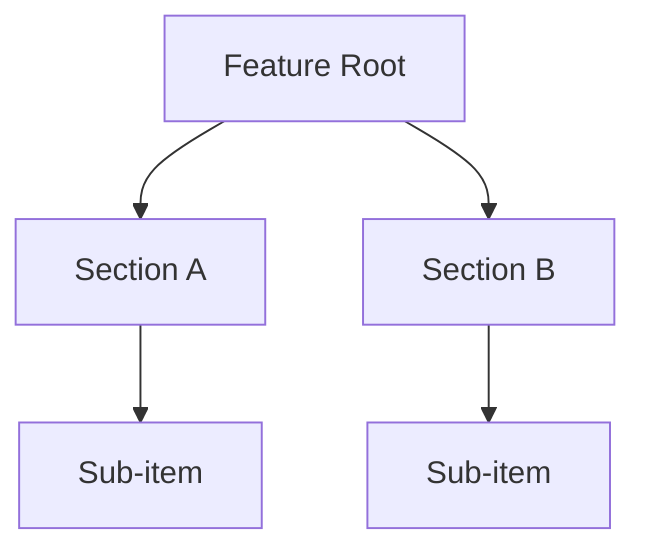
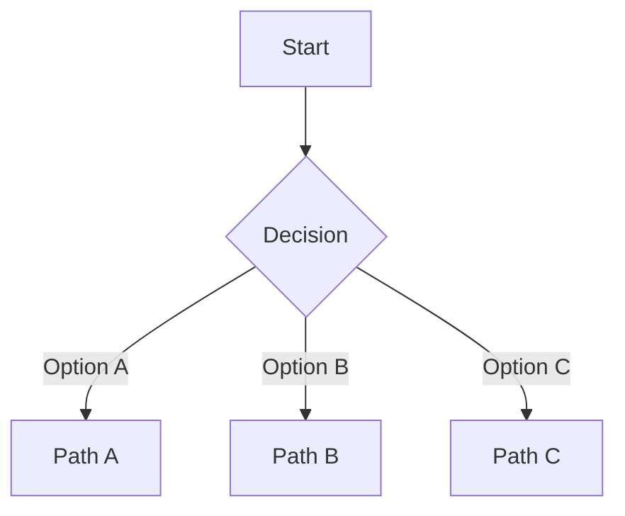

# Shipwright Design

UX Design Strategist-led design thinking: jobs-to-be-done, mental model
mapping, information architecture, interaction principles, design critique,
accessibility strategy, and component inventory.

## Role Loading

Read and apply this role perspective for this phase:

- [UX Design Strategist](../roles/ux-designer.md) (lead role)

If the role file cannot be loaded: "WARNING: Could not load UX Design Strategist role. Proceeding with reduced capability."

## Context Bootstrapping

If `$ARGUMENTS` is a file path ending in `.md`, read it as an upstream
discovery doc. Extract:
- Problem statement and success criteria
- User types identified
- Scoped feature list (in/out)
- Any existing flow notes

If `$ARGUMENTS` is a text description, proceed without upstream — note
the absence and proceed with what the user provided.

If scope is unclear after reading the input, ask **one** clarifying question
before proceeding. Do not loop on clarification — after one answer, proceed
with stated assumptions.

## Outcome

Produce a design artifact containing ALL of these sections:

- **Jobs-to-be-done** — the user's intent and switching context
- **Mental model** — how the user thinks about this domain
- **Information architecture** — structure, grouping, naming (Mermaid if 3+ levels)
- **User decision points** — where choices happen, what's needed (Mermaid if 3+ branches)
- **Interaction principles** — 3–5 named constraints that govern the experience
- **Design critique** — adversarial pass: where will users get confused even when it works?
- **Accessibility strategy** — interaction model, screen reader, colour, motion
- **Component/pattern inventory** — what patterns apply, what needs to be invented

## How to Get There

Apply the UX Design Strategist perspective throughout. Work strategy before execution — understand intent and mental model before mapping flows or listing components.

### 1. Jobs-to-be-Done

Frame the feature from the user's perspective using the JTBD format:

> "When [situation], I want to [motivation], so I can [outcome]."

Add switching context: what does the user do today instead of using this feature? What frustration does this resolve?

If there are multiple distinct user types from the discovery doc, write a JTBD statement for each.

### 2. Mental Model Mapping

Describe how the user thinks about this domain *before* touching the product. What analogies do they carry in? What do they expect based on similar tools?

Identify where the product's model aligns with the user's mental model and where it diverges. Divergences are design debt — they require affordances, onboarding, or renamed concepts to bridge the gap.

### 3. Information Architecture

Map how the feature is organised: what is grouped, what is separated, what is named.

Use plain text hierarchy for simple structures. Use Mermaid for hierarchies with 3+ levels or when relationships between sections matter:



Name every grouping and label explicitly — naming decisions are UX decisions. A poorly named section will confuse users regardless of how well it is implemented.

### 4. User Decision Points

List every point in the experience where the user makes a decision. For each:
- What does the user see?
- What are their options?
- What context do they need to choose confidently?
- What happens on each path?

Use plain text for linear flows. Use Mermaid for flows with 3+ branches:



Also map the primary error path and empty state: what does the user experience when something goes wrong or when they arrive with no data?

### 5. Interaction Principles

Write 3–5 named principles that explicitly govern this experience. These become the design contract — the developer tests against them during build, the QA tests against them during ship.

Each principle is one sentence in the form: **[Name]** — [what it means in practice].

Examples:
- **Progressive disclosure** — show only what the user needs at this step; reveal complexity on demand via explicit controls
- **Single primary action** — each screen has one visually dominant action; all others are secondary

Bad principles ("be clear", "be simple") are not actionable — a developer cannot test against them. Good principles are constraints that can be violated and detected.

### 6. Design Critique

Apply adversarial thinking. Ask: where will users get confused, misled, or stuck — even when the code is working correctly?

Look for:
- Ambiguous labels (two things with similar names, or a name that means different things to different users)
- Invisible state (the user can't tell what mode they're in, what the system is doing, or whether an action succeeded)
- Missing affordances (the feature exists but users won't discover it)
- Assumption mismatch (the feature assumes knowledge the user doesn't have)
- Recoverable vs. unrecoverable errors (are destructive actions guarded?)

Rate each finding: **High** (user cannot complete their goal) / **Medium** (user is confused but can recover) / **Low** (friction, not a blocker).

### 7. Accessibility Strategy

Write a strategy, not a checklist. Cover:

- **Interaction model** — what does this feature require? Pointer, keyboard, touch, voice?
- **Screen reader** — what gets announced, when, in what order? Are dynamic updates announced?
- **Colour and contrast** — is colour used as the sole means of conveying information?
- **Motion** — does the feature use animation? Does it respect `prefers-reduced-motion`?

### 8. Component/Pattern Inventory

List the UI patterns this feature uses. For each, note whether it's a standard pattern (reusing a well-known convention) or custom (being invented for this feature).

Custom patterns carry a learning cost — flag them explicitly and consider whether a standard pattern could serve instead.

## Save Artifact

Before presenting the transition:

```bash
mkdir -p docs/shipwright/design/
```

Save the design document to `docs/shipwright/design/YYYY-MM-DD-<topic>.md`.

Match the `<topic>` slug to the upstream discovery doc's topic if one was provided. Otherwise derive a concise kebab-case slug from the description.

Use this frontmatter:

```yaml
---
type: design
topic: <topic-slug>
tier: <major|standard>
status: complete
date: YYYY-MM-DD
upstream: <path-to-discovery-doc, or null>
---
```

Write the artifact to disk before presenting transition options.

## Transition

After saving, announce:

> Design strategy complete. Invoke `/sw-plan docs/shipwright/design/YYYY-MM-DD-<topic>.md` to plan the implementation.

The user can also:

- Refine the design artifact further
- Skip to plan with the discovery doc directly
- Stop here — the design artifact is useful standalone

## Design Artifact Template

```markdown
---
type: design
topic: <topic-slug>
tier: major
status: complete
date: YYYY-MM-DD
upstream: null
---

# Design: <Feature Name>

## Jobs-to-be-Done

**Primary:** When [situation], I want to [motivation], so I can [outcome].

**Switching context:** Today, users [what they do instead]. The friction is [what this resolves].

## Mental Model

[How the user thinks about this domain before touching the product.
Where the product model aligns vs. diverges from their expectations.]

## Information Architecture

[Text hierarchy or Mermaid diagram]

## User Decision Points

[Text list or Mermaid flowchart]

### Error Path

[What the user experiences when something goes wrong]

### Empty State

[What the user sees on first use or when there is no data]

## Interaction Principles

- **[Principle name]** — [one sentence: what it means in practice]
- **[Principle name]** — [one sentence]
- **[Principle name]** — [one sentence]

## Design Critique

| Severity | Finding | Location | Recommendation |
|----------|---------|----------|----------------|
| High | [description] | [where] | [what to do] |
| Medium | [description] | [where] | [what to do] |

## Accessibility Strategy

- **Interaction model:** [pointer / keyboard / touch / voice requirements]
- **Screen reader:** [what gets announced and when]
- **Colour and contrast:** [any colour-only information? contrast targets]
- **Motion:** [animation use; prefers-reduced-motion handling]

## Component/Pattern Inventory

| Pattern | Where used | Standard or custom |
|---------|------------|-------------------|
| [Name] | [Context] | Standard / Custom |
```

## Principles

- Strategy before execution. Understand intent and mental model before mapping flows.
- Text by default, Mermaid when it earns its complexity (3+ hierarchy levels, 3+ branches).
- Interaction principles must be testable. "Be clear" is not a principle — a developer cannot test against it.
- Design critique is mandatory. Adversarial UX catches what optimistic design misses.
- Accessibility is a strategy question asked at the start, not a checklist appended at the end.
- Suggest, never block. If the user wants to skip sections or move directly to planning, let them.
